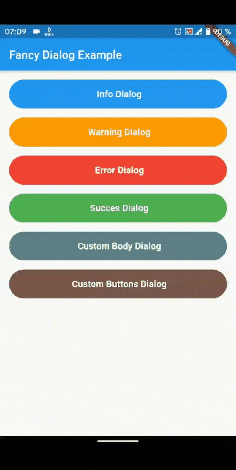

# awesome_dialog

A new Flutter package project for simple and awesome dialogs

## Usage

To use this package, add awesome_dialog as a dependency in your pubspec.yaml file.
And add this import to your file.

import 'package:awesome_dialog/awesome_dialog.dart';

## Image


### Example

```
AwesomeDialog(context: context,
            dialogType: DialogType.INFO,
            animType: AnimType.BOTTOMSLIDE,
            title: 'Dialog Title',
            desc: 'Dialog description here..................................................',
            btnCancelOnPress: () {},
            btnOkOnPress: () {}).show();
```

## Custom Body

If the body is specified, then title and description will be ignored, this allows to further customize the dialogue.

```
AwesomeDialog(
            context: context,
            animType: AnimType.SCALE,
            dialogType: DialogType.INFO,
            body: Center(child: Text(
                    'If the body is specified, then title and description will be ignored, this allows to further customize the dialogue.',
                    style: TextStyle(fontStyle: FontStyle.italic),
                  ),),
            title: 'This is Ignored',
            desc:   'This is also Ignored',
            btnOkOnPress: () {},
                 ).show();
```

## Custom Button

To use custom buttons, just specify the buttonOk or btnCancel widget, all text parameters icon etc will be ignored.

## Dissmiss and Callback

AwesomeDialog has onDissmissCallback() and can be dissmissed at any time using dissmiss() public method.

### AwesomeDialog Class

| Dart attribute        | Datatype       | Description                                                           |                                          Default Value                                          |
| :-------------------- | :------------- | :-------------------------------------------------------------------- | :---------------------------------------------------------------------------------------------: |
| dialogType            | DialogType     | Set DialogType example: DialogType.INFO, this create an animated Header.|   Null  |
| customHeader          | Widget         | Create your own header(if this is set DiaologType is ignored.)             |   Null         |
| title                 | String         | Set the title of dialog.                         |            Null                  |
| desc                  | String         | Set the description text of the dialog.               |  Null |
| body                  | Widget         | Create your own Widget for body, if this property is set title and description will be gnored.                             |  Null  
| context             | BuildContext          | @required                |           Null                      |
| btnOkText | String          | Text of positive button                         |                                          'Ok'  |
| btnOkIcon | IconData          | Icon of positive button                       |                                          Null  |
| btnOkOnPress | Function          | Function that handle click of postive Button, closing the dialog is handled internally.  |   Null  |
| btnOkColor | Color          | Color of postive Button  |   Color(0xFF00CA71) |
| btnOk | Widget          |  Allows to create a custom button, if this property is different from null then btnOkText, btnOkIcon, btnOkOnPress, btnOkColor will be ignored  | null  |
| btnCancelText | String          | Text of negative button                         |                                          'Cancel'  |
| btnCancelIcon | IconData          | Icon of negative button                       |                                          Null  |
| btnCancelOnPress | Function       | Function that handle click of negative Button, closing the dialog is handled internally.  | Null  |
| btnCancelColor | Color          | Color of negative Button  |   Colors.red |
| btnCancel | Widget          |  Allows to create a custom button, if this property is different from null then btnCancelText, btnCancelIcon, btnCancelOnPress, btnCancelColor will be ignored  | null  |
|dismissOnTouchOutside             | bool      | Dissmiss dialog on touch overlay    | true |
|onDissmissCallback            | Function      | Dissmiss callback funtion    | Null |
| animType             | AnimType      | Type of dialogue enter animation                                 | AnimType.SCALE |
| aligment             | AlignmentGeometry      | dialogue aligment gravity                                | Alignment.center |
| useRootNavigator     | bool    | Use the root navigator instead than the local. This is usefuk when the defaut cancel go to the previous screen instead to just close the dialog | false |


